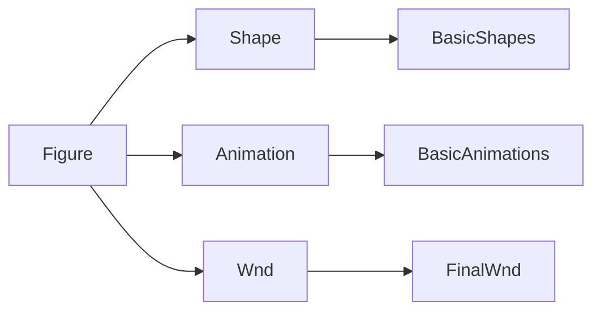

# WndDesign 窗口设计工具

[toc]

## 简介

WndDesign工具是一款基于win32API的窗口设计工具，使用c++编写。

## 基本类

```mermaid
graph LR
	Figure --> Shape
	Shape --> BasicShapes
	Figure --> Animation
	Animation --> BasicAnimations
	Figure --> Wnd
	Wnd --> FinalWnd
```

